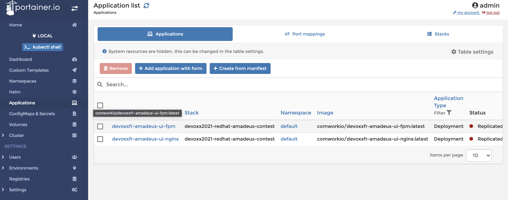

# Demo using Portainer with K8S

## Table of content

[[_TOC_]]

## Git repositories

* Main repo: https://gitlab.comwork.io/oss/demo-portainer-k8s
* Github mirror: https://github.com/idrissneumann/demo-portainer-k8s.git
* Gitlab mirror: https://gitlab.com/ineumann/demo-portainer-k8s.git

## Install k3d

```shell
curl -s https://raw.githubusercontent.com/rancher/k3d/main/install.sh | bash
k3d cluster create localdevr --api-port 6550 -p "9081:80@loadbalancer"
```

## Upgrade portainer manifest

```shell
curl https://raw.githubusercontent.com/portainer/portainer-k8s/master/portainer-nodeport.yaml -o portainer.yaml
```

## Deploy

```shell
kubectl create namespace portainer
kubectl -n portainer apply -k .
```

Then here you go: http://localhost:9081/

Create a user password `admin` / `portainer1234` for example.

## Deploy an app on portainer from docker-compose files

You can try to deploy the demo app from the docker-compose file on Kubernetes:


The result will be:


